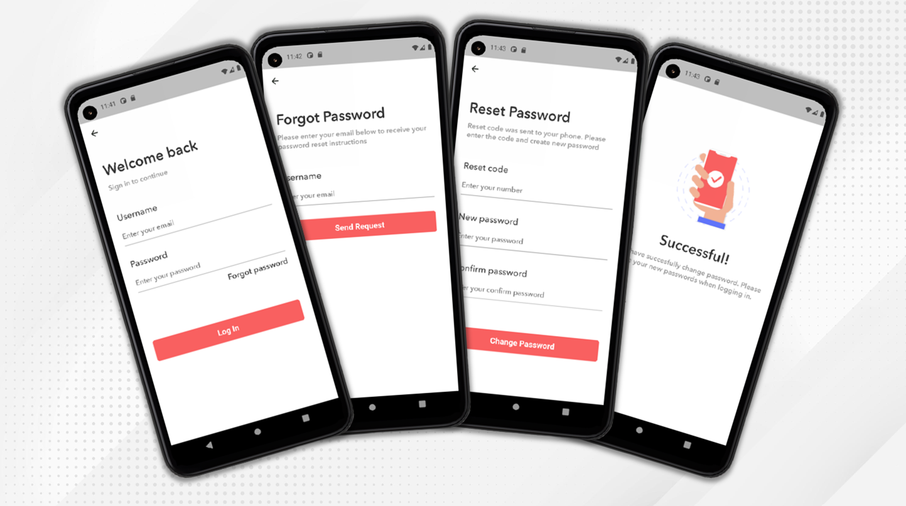
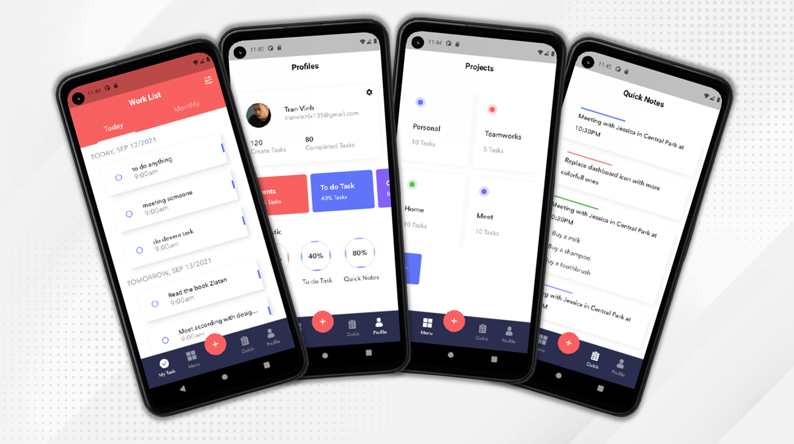
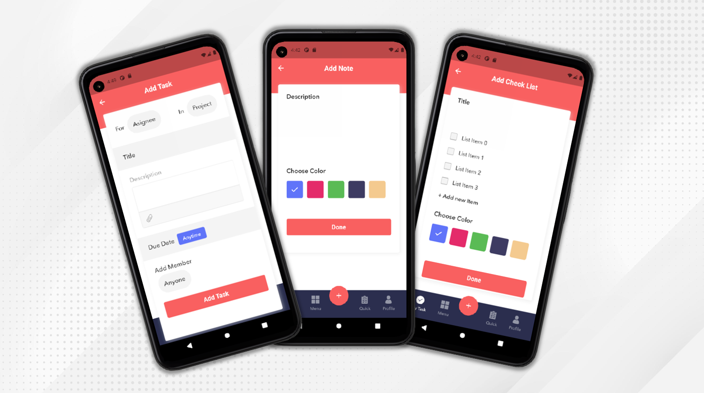

<h1 align="center">Aking To Do List</h1>

Create task list

 

## Getting Started

This project is used in Devera Flutter course to demonstrate how to do list with Flutter.

## Interface
### Init screens

### Login screens

### Home screens

### Add screens

### Detail screens

### File Debug
[app-debug.apk](https://drive.google.com/file/d/1XUwSrw8rj1JfaAO49Mqukl2Cv49KM4LC/view?usp=sharing)

## Pub Packages

| Package  | Usage |
| ------ | ------ |
| [Provider](https://pub.dev/packages/provider) |  A wrapper around InheritedWidget to make them easier to use and more reusable.
| [Sqflite](https://pub.dev/packages/sqflite) |  A self-contained, high-reliability, embedded, SQL database engine.
| [Path](https://pub.dev/packages/path) | Provides common operations for manipulating paths: joining, splitting, normalizing, etc.
| [Flutter Svg](https://pub.dev/packages/flutter_svg) | Allow painting and displaying Scalable Vector Graphics 1.1 files
| [Table Calendar](https://pub.dev/packages/table_calendar) | Highly customizable, feature-packed calendar widget for Flutter.
| [Flutter Slidable](https://pub.dev/packages/flutter_slidable) | A Flutter implementation of slidable list item with directional slide actions that can be dismissed.
