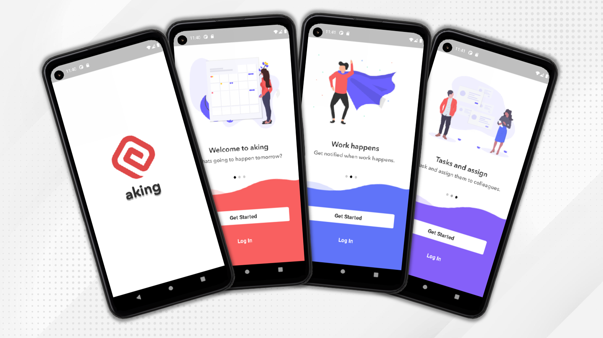

<h1 align="center">Aking To Do List</h1>

Create task list

 

## Getting Started

This project is used in Devera Flutter course to demonstrate how to do list with Flutter.

## Interface
### Init screens

### Login screens

### Home screens

## Pub Packages

| Package  | Usage |
| ------ | ------ |
| [Provider](https://pub.dev/packages/provider) |  ICON supports SDK for 3rd party or user services development on Icon network. 
| [Sqflite](https://pub.dev/packages/sqflite) | A Flutter plugin to use the Firebase Core API, which enables connecting to multiple Firebase apps.
| [Path](https://pub.dev/packages/path) | Firebase Authentication provides backend services & easy-to-use SDKs to authenticate users to your app. 
| [Flutter Svg](https://pub.dev/packages/flutter_svg) | Firebase Authentication provides backend services & easy-to-use SDKs to authenticate users to your app. 
| [Table Calendar](https://pub.dev/packages/table_calendar) | Firebase Authentication provides backend services & easy-to-use SDKs to authenticate users to your app. 
| [Flutter Slidable](https://pub.dev/packages/flutter_slidable) | Firebase Authentication provides backend services & easy-to-use SDKs to authenticate users to your app. 

